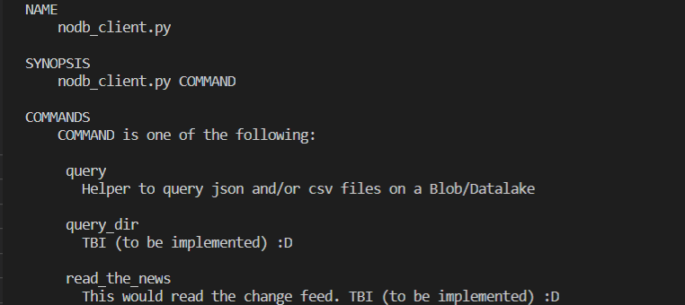

## nodbdb

Well, it's a helper to query files in an Azure blob/data lake storage using Azure Storage [Query Acceleration](https://docs.microsoft.com/en-us/azure/storage/blobs/data-lake-storage-query-acceleration). 
As you do in a DB. 
But it's not a DB.  

### Use Case
Imagine you have a couple of files in an Azure Data Lake Storage, csv and/or json files. Say you need to query and/or make simple aggregations about information in them. You don't have to have it in *real time*, you know sql and know how to throw a couple of lines of python too. You start thinking in a creative way to do it when...

***A rabbit hole opens right in front of your eyes.***

***A pack of consultants emerges from it, almost shouting in unison:*** 
>**We have THE Solution!**

Then they started each their own monotone monologue. 
Consultant 1: "You should create a notebook in Azure Databricks!!!" 
Consultant 2: "You can use Polybase from a Synapse Analytics instance!!!" 
Consultant 3: "You need to create a Synapse Analytics Workspace and then you can choose either SQL or Spark to query them!!! 
There was a Consultant 4 a little behind, looking down and murmuring: "You could've done it just fine with Azure Data Lake Analytics" 
I started to feel dizzy, but instead of going down the hole I heard my wife yelling at me: Snap out of it!!! 
And she was right. 
I was overwhelmed by the different choices I have if I need to query something in ADFS to and their complexity. Sure, they are great for a big workload, but wanted to explore simpler ways and remembered this *quick query* thing we have there. So I went and started to write somenthin that would let me do just that, without implementing any other product and using one-liners 

_... to be continued ..._

While I'm hopefully learning and working on ending this, here's a very good explanation of the feature and how to [code it in C#](https://dev.to/shibayan/query-acceleration-for-adls-alternative-to-the-lightweight-synapse-analytics-5027)

### Features
- Access via URI + SAS key
- Query a csv file
- Query a json file
- Client works as a CLI tool (with Python Fire)
- Read configuration from json file
### Futures
- Query a folder
- Make this a CLI tool using click framework (wish listed)